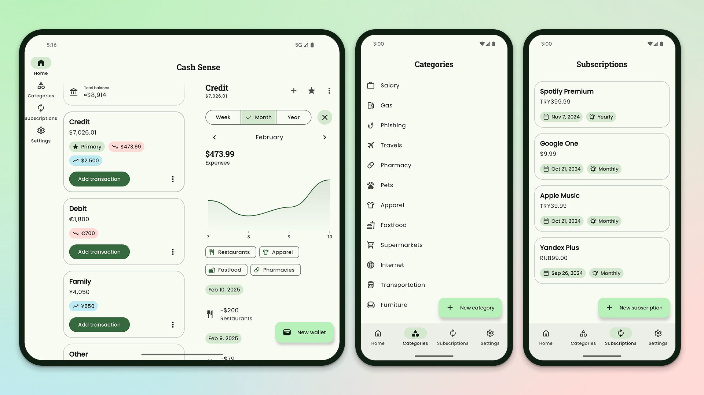

# Cash Sense

A professional financial management solution for Android, engineered for precision, privacy, and
seamless user experience. It empowers users to maintain absolute control over their capital through
multi-currency support, intelligent transaction categorization, and proactive subscription tracking.

## Features

- **Multi-Currency Wallets** – Architected to manage diverse financial portfolios. Create and
  monitor multiple wallets with native support for global currencies.
- **Intelligent Categorization** – Gain deep insights into spending patterns. Organize transactions
  with customizable categories tailored to your unique financial structure.
- **Subscription Management** – Proactive monitoring of recurring commitments. Never overlook a
  payment with dedicated tracking for all your active subscriptions.
- **Precision Transfers** – Seamlessly execute and record internal capital movement between wallets,
  ensuring real-time balance accuracy across all accounts.

## Screenshots

# UI

The application strictly adheres to the **Material 3 Expressive** design principles, offering a
refined,
modern, and accessible interface built entirely with **Jetpack Compose**.

* **Adaptive Architecture** – Fully optimized layouts for a consistent experience across
  smartphones, tablets, and foldable devices.
* **Advanced Theming** – Comprehensive support for **Dynamic Color** (Android 12+), dark mode, and
  three distinct levels of contrast for enhanced legibility.
* **Motion Design** – Fluid interactions powered by **Lottie** animations and **Shared Element
  Transitions** for a cohesive navigational flow.

## Technical Architecture

Built with a commitment to modern Android development standards, ensuring scalability, performance,
and maintainability.

* **Core Architecture**: Clean Architecture principles with Unidirectional Data Flow.
* **UI Framework**: 100% Jetpack Compose with Material 3 Expressive components.
* **Navigation**: Type-safe navigation powered by Navigation 3.
* **Dependency Injection**: Robust dependency management using Hilt.
* **Data Persistence**: Reliable local storage via Room & DataStore.
* **Networking**: High-performance asynchronous communication with Ktor.
* **Background Processing**: Efficient task scheduling through WorkManager.
* **Concurrency**: Reactive programming with Kotlin Coroutines and Flow.

## Localization

The application is global-ready. We invite you to contribute to our localization efforts
on [Crowdin](https://crowdin.com/project/cashsense) to help make financial clarity accessible to
everyone in their native language.

## Support

If you find this tool valuable, consider supporting its continued development:

| Asset              | Address                                        |
|:-------------------|:-----------------------------------------------|
| **Bitcoin (BTC)**  | `bc1qn2dd85ek6dm8mm3wu3ws6cq507zgrtlgatl20z`   |
| **Ethereum (ETH)** | `0x78cD353134CbffeD8B941fF05a3Ac8B0bBd308e6`   |
| **USDT (TRC20)**   | `TNs7AvHQ2TjFDKMA7nJ1US31A57tRUMvqN`           |
| **Solana (SOL)**   | `G1zAFSJpbHcjwSvMjQuKZj99abZDmP4pSRdkKRaAWFFk` |
| **Litecoin (LTC)** | `ltc1q8qrcnc6y3ajg7xslaxy6n90d8hk3252amzq8aw`  |

## License

Open-source software licensed under the **Apache License 2.0**. See the [LICENSE](LICENSE) file for
full details.

[m3]: https://m3.material.io/

[m3contrast]: https://m3.material.io/styles/color/system/how-the-system-works#0207ef40-7f0d-4da8-9280-f062aa6b3e04

[m3colorSystem]: https://m3.material.io/styles/color/system/how-the-system-works#da0abfef-1503-477d-a3d7-9378b4a9948e

[compose]: https://developer.android.com/jetpack/compose

[composeSharedElements]: https://developer.android.com/develop/ui/compose/animation/shared-elements

[lottie]: https://github.com/airbnb/lottie/blob/master/android-compose.md

[nav3]: https://developer.android.com/guide/navigation/navigation-3

[hilt]: https://developer.android.com/training/dependency-injection/hilt-android

[room]: https://developer.android.com/training/data-storage/room

[datastore]: https://developer.android.com/topic/libraries/architecture/datastore

[ktor]: https://ktor.io/

[workmanager]: https://developer.android.com/topic/libraries/architecture/workmanager

[coroutines]: https://kotlinlang.org/docs/coroutines-overview.html

[flow]: https://kotlinlang.org/docs/flow.html
